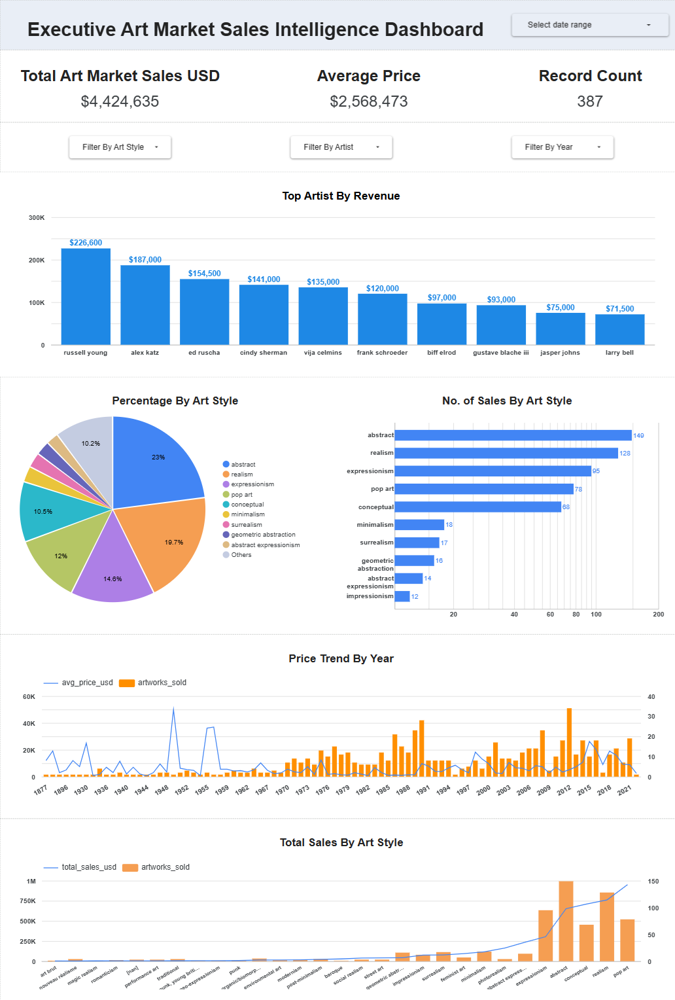
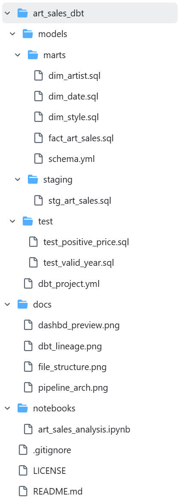
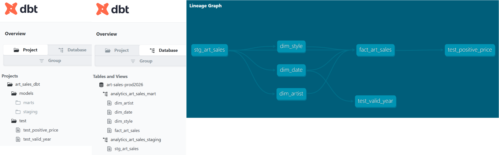
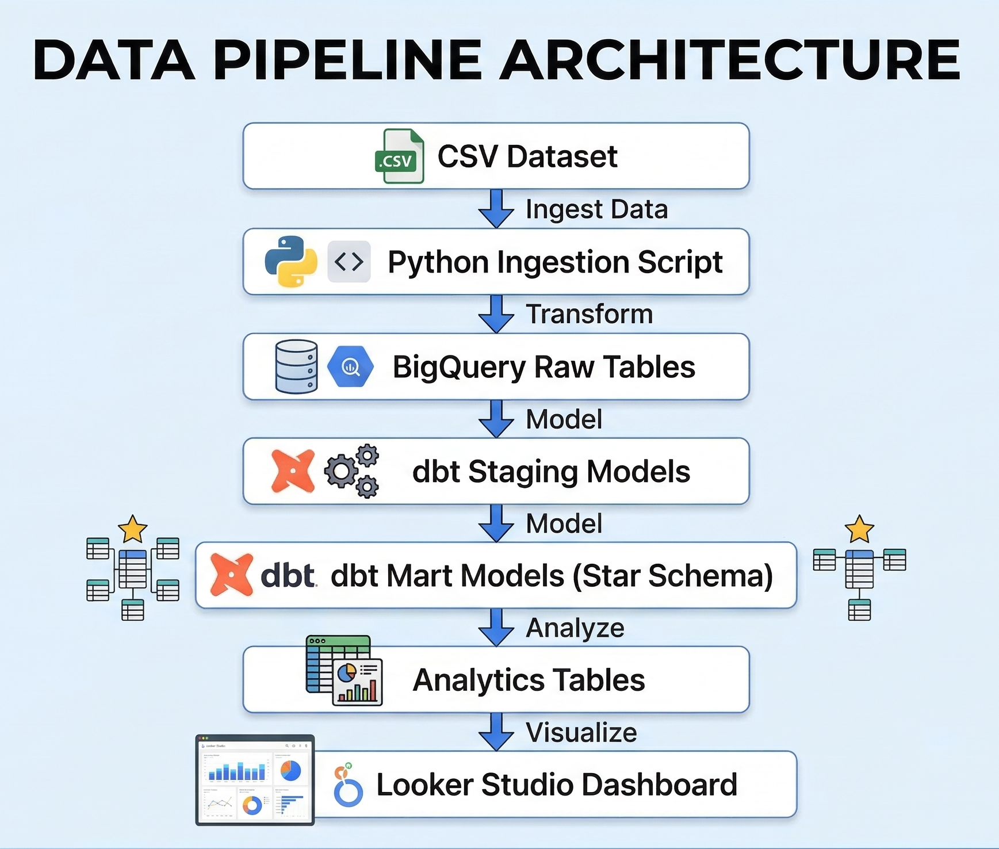

# art-sales-bigquery-dbt project
Production-ready art sales cloud end-to-end analytics engineering project demonstrating a modern ELT pipeline using Github, VS Code + WSL Ubuntu + Python 3.11 + Conda + GCP + BigQuery + dbt + Looker Studio

This project builds an end-to-end analytics pipeline for art auction data using BigQuery and dbt. Raw CSV data is ingested into a cloud data warehouse, transformed into a dimensional star schema using dbt, and visualized through an interactive dashboard.

## Focus Learning:
```
Python Ingestion
Cloud data warehouse
Data modeling
Analytics engineering
Dashboarding
```
## ELT Analytics Stack:
```
CSV dataset
     ↓
Python ingestion
     ↓
BigQuery raw tables
     ↓
dbt transformations
     ↓
Star schema warehouse
     ↓
Python analysis notebook
     ↓
Looker dashboard
```
---

## 📊 Executive Art Market Intelligence Dashboard

This dashboard visualizes insights from the art sales data pipeline built using:

- Python (data ingestion)
- BigQuery (data warehouse)
- dbt (data transformations & orchestration)
- Looker Studio (business intelligence)

🔗 **Live Dashboard**

View the Interactive Dashboard  
LIVE:[https://lookerstudio.google.com/reporting/abcd1234/page/p_xyz](https://lookerstudio.google.com/reporting/ed13ddd8-bc45-4ed7-9e4e-0e0e9f6262f3)

---

## 📊 Dashboard Preview



---

## Project Overview

This project builds an end-to-end data pipeline to analyze art market sales data.

The pipeline ingests raw CSV data, loads it into a cloud data warehouse, transforms it into a dimensional model using dbt, complete data quality testing and visualizes insights through a BI dashboard.

---

## Architecture
```
CSV Dataset
↓
Python Data Ingestion
↓
BigQuery Raw Layer
↓
dbt Staging Models
↓
Data Quality Gate 1: (Unique, Null Value)
↓
dbt Mart Models (Star Schema)
↓
Data Quality Gate 2: (Referential Integrity, Business Logic)
↓
Analytics Tables
↓
Looker Studio Dashboard
```
---

## Tech Stack
```
- Python
- Google BigQuery
- dbt
- Looker Studio
- GitHub
```
---

## Data Pipeline Steps

### 1 - Data Ingestion

Raw CSV data is loaded into BigQuery using:
```
python load_raw.py
```
This loads data into:
```
art_sales_raw.raw_art_sales
```
### 2 - Data Transformation (dbt) / Orchestration - manual
Orchestration is manual due to small scale project: 1 dataset, 1 warehouse and 1 dbt project

Run dbt models:
```
cd art_sales_dbt
dbt run
dbt test
```
Models created:
```
stg_art_sales
dim_artist
dim_style
dim_date
fact_art_sales
```
### 3 - Star Schema
```
fact_art_sales
 ├ artist_id → dim_artist
 ├ style_id → dim_style
 └ year_id → dim_date
```
Fact table:

- fact_art_sales
  
Dimension tables:

- dim_artist
- dim_style
- dim_date

### 4 - Analytics Models

Analytics tables used for the dashboard:

- top_artists
- sales_by_style
- price_trend_by_year
  
### 5 - Data Quality Testing

Data quality is validated using dbt tests and SQL checks.
Implemented checks include: 

1️⃣ Null values validation
2️⃣ Duplicates detection
3️⃣ Referential integrity checks
4️⃣ Business rule validation (positive price)

```
test/test_positive_price.sql  
models/mart/schema.yml        
test/test_valid_year.sql
```

### 6 - Validation

```
notebooks/art_sales_analysis.ipynb
```
The Jupyter notebook shows:

- validation queries
- trend analysis
- Python analytics

---

### 5 - Dashboard

Interactive dashboard built in Looker Studio.

Features:

- Total sales KPIs
- Top artists
- Sales by art movement
- Price trends over time

---

## Dataset

Dataset source:
```
Kaggle Art Sales Dataset
```
Download and place in:
```
data/artDataset.csv
```
Dataset is not stored in Github repository due to file size limits (100MB).

---

## Project Structure
```
art-sales-bigquery-dbt
|
|--art_sales_dbt  # dbt models and tests
|--docs           # dashboard screenshot
|--notebooks      # analysis
|--load_raw.py    # ingestion script (*removed after initial ingestion for security reason)
|--README.md
|--.gitignore
```
### Folder Structure 



### Data Lineage and Database Structure



### Data Pipeline Workflow & Architecture

1. Raw art dataset CSV is ingested using Python.
2. Data is loaded into BigQuery raw tables.
3. dbt transforms raw tables into staging models.
4. dbt and SQL checks for data quality.
5. dbt builds dimensional mart tables.
6. Data is analyzed using Python notebooks.
7. Business insights are visualized using Looker Studio.



---

## Future Improvements

- Add pipeline automation
- Add scheduled orchestration
- Add machine learning forecasting

### Pipeline Automation
- Optional Schedule Pipeline with Github Automation
- Create:
  ```
  .github/workflows/pipeline.yml
  ```
  Example:
  ```
  name: Run Data Pipeline

  on:
  workflow_dispatch:

  jobs:
    pipeline:
      runs-on: ubuntu-latest

    steps:
    - uses: actions/checkout@v3

    - name: Install Python
      uses: actions/setup-python@v4
      with:
        python-version: '3.11'

    - name: Install dependencies
      run: |
        pip install dbt-bigquery pandas google-cloud-bigquery

    - name: Run pipeline
      run: |
        python load_raw.py
        cd art_sales_dbt
        dbt run
        dbt test
  ```
  ### Schedule Orchestration
  - Create a single pipeline script option to run automatically:
    ```
    run_pipeline.sh
    ```
    Example:
    ```
    #!/bin/bash

    echo "Running data ingestion..."
    python load_raw.py

    echo "Running dbt transformation..."
    cd art_Sales_dbt
    dbt run
    dbt test

    echo "Pipeline completed."
    ```
    Run:
    ```
    bash run_pipeline.sh
    ```
    
        
